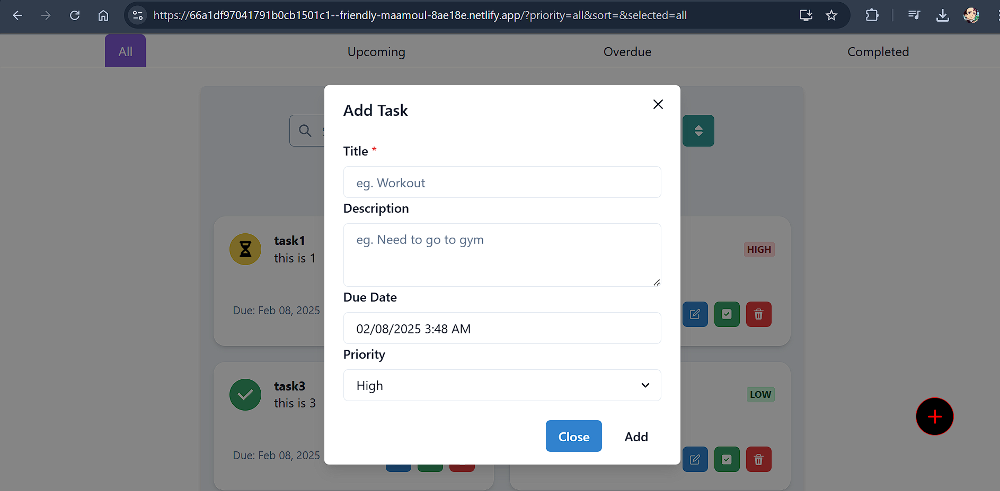
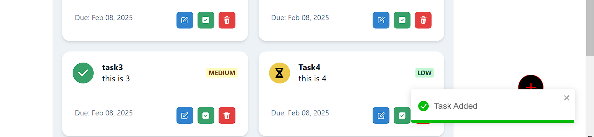
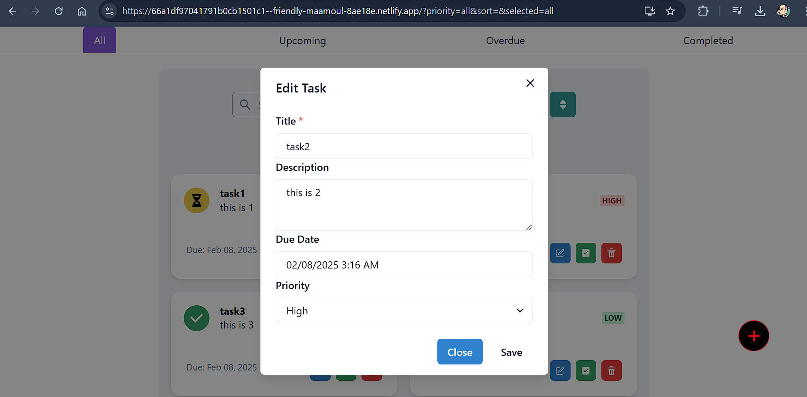
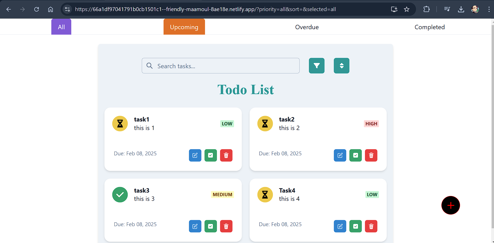
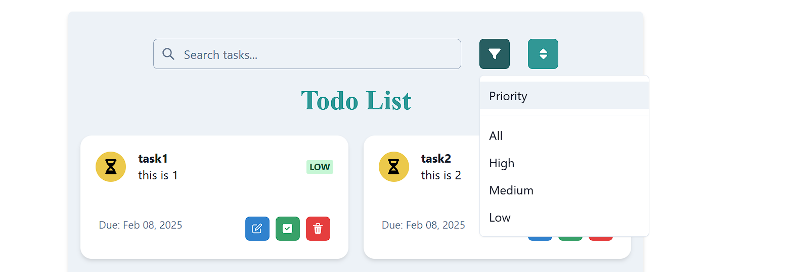

# Elitefit AI Todo List

## Demo

Live Demo Working Link - [task-manager.netlify](https://66a1df97041791b0cb1501c1--friendly-maamoul-8ae18e.netlify.app)

## Features

### Task Addition

Create new tasks with ease.


### Task Creation Feedback

Receive feedback after a task is created.


### Edit Task

Update your tasks as needed.


### Task Card

Displays task title, priority level, due date, description, and allows you to update, delete, or complete the task.


### Task Status

- **Red**: Overdue
- **Green**: Completed
- **Yellow**: Pending

### Task Selection and Search

- Select task category from the navbar.
- Search tasks based on title or description.
- Sort and filter tasks based on priority and dates.
  

## Local Setup

Ensure you have the following installed on your machine:

- Node.js: [Download Node.js](https://nodejs.org/)
- Git: [Download Git](https://git-scm.com/)

### Steps

1. Clone the GitHub repository:

`git clone https://github.com/sandeeppatel2001/Elitefite-AI`

2. Navigate to project directory

```
cd Elitefit-AI
```

3. Install Dependencies

```
npm install
```

4. Run the application

```
npm start
```
